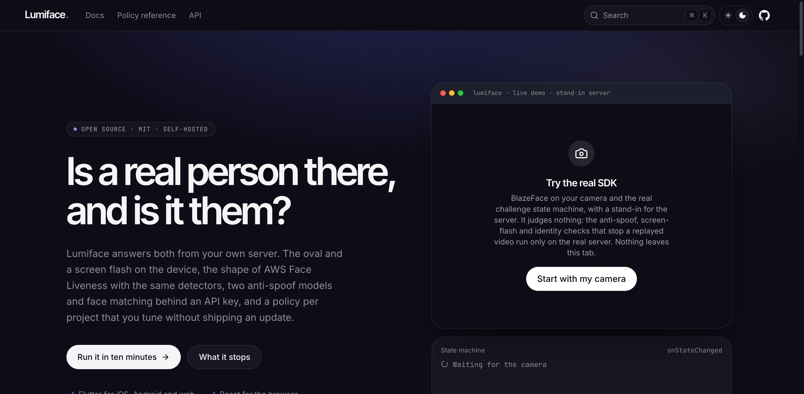
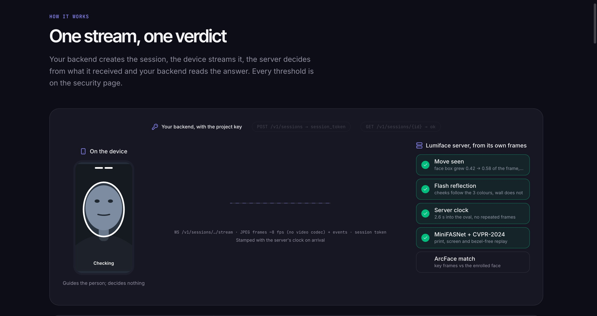

<p align="center">
  <picture>
    <source media="(prefers-color-scheme: dark)" srcset="docs/images/logo-dark.svg">
    
  </picture>
</p>

<p align="center">
  Self-hosted face verification with active liveness.<br>
  The oval and a screen flash on the device (the oval-and-flash flow), two anti-spoof models and ArcFace matching on your server, one policy per project.
</p>

<p align="center">
  <a href="https://github.com/GA-MO/lumiface/actions/workflows/ci.yml"></a>
  <a href="https://github.com/GA-MO/lumiface/actions/workflows/pages.yml"></a>
  
  
  
  
</p>

<p align="center">
  <a href="https://ga-mo.github.io/lumiface/">Docs</a> ·
  <a href="https://ga-mo.github.io/lumiface/docs/get-started">Get started</a> ·
  <a href="https://ga-mo.github.io/lumiface/docs/concepts">Concepts</a> ·
  <a href="https://ga-mo.github.io/lumiface/docs/flutter">Flutter</a> ·
  <a href="https://ga-mo.github.io/lumiface/docs/react">React</a> ·
  <a href="https://ga-mo.github.io/lumiface/docs/api">API</a> ·
  <a href="https://ga-mo.github.io/lumiface/docs/policy-reference">Policy reference</a> ·
  <a href="https://ga-mo.github.io/lumiface/docs/security">Security</a>
</p>

<p align="center">
  
</p>

## What it is

A selfie login usually ends at "a face was detected". Lumiface answers two questions instead: **is a real person in front of the camera**, and **is it the person in the photo you hold**. The device runs a short session — guided by a face box from BlazeFace (web, Android) or Apple Vision (iOS): move the face into the oval the server drew, then three screen-flash colours the server picked — while the camera is recorded and streamed over a WebSocket the whole time (H.264 from the phone encoders, MediaRecorder on the web, about 30 fps). The server clocks the session itself, confirms the move into the oval from its own detector inside its window, checks that the cheeks reflected the flash colours in order, runs MiniFASNet and a CVPR-2024 anti-spoof gate on the key frames, and matches **every key frame and every flash frame** against the ArcFace embedding of the reference photo your backend sent with the session. One stream, one `{ok, reason_code, scores}`.

Faces never leave your network. The server is a FastAPI app with SQLite or Postgres; the models run on CPU. Every project has an API key and a **policy**, a preset plus overrides for every threshold, changed through the API without a redeploy or an app update.

## Features

- **Identity, not only liveness.** Your backend sends the person's photo as `reference_photo` when it creates the session; the server computes the cosine similarity of every frame against it (ArcFace, InsightFace buffalo_l: 99.52% on LFW, EER 0.83%) and fails with `NO_MATCH` when any frame is under `match_threshold`; frames must also match each other (`INCONSISTENT`). Without a photo the same session is a liveness check.
- **Nothing enrolled, nothing kept.** There is no subject store: the photo's embedding lives on the session row only until the device opens the stream, then it is deleted. Your users and their photos stay in your system.
- **Active liveness, guided on the device, judged on the server.** TensorFlow.js BlazeFace (web), TensorFlow Lite BlazeFace (Android) or Apple Vision (iOS) guide the face into the server's oval; the server re-reads the move from its own detector, so a patched client gains nothing.
- **Screen flash.** Three server-chosen colours; the server correlates the chroma deltas on the face with the sequence and rejects when the background reflected as much as the face.
- **Two anti-spoof models.** MiniFASNet for prints and screens, the CVPR-2024 ResNet50 gate for bezel-free replay, on every key frame.
- **One policy per project.** `balanced`, `strict`, `relaxed`, `emulator` presets plus per-threshold overrides through `PUT /v1/policy`; the session carries the client tunables, so apps follow the policy without a rebuild.
- **Two SDKs.** `verify` or `liveness` from Flutter (`FaceVerifyView`) or React (`LumifaceView`), both with a headless controller, themes, and strings in English and Thai.
- **Every code documented.** `TIMING_TOO_FAST`, `SPOOF`, `FLASH_FAIL`, `NO_MATCH`, ... each with who raises it and what the user should do. See [reason codes](https://ga-mo.github.io/lumiface/docs/reason-codes).

## Quick start

Run the server, create a session with a photo, verify it. [Get started](https://ga-mo.github.io/lumiface/docs/get-started) walks through the same steps with the example app and the React demo.

```bash
cd server
uv sync && uv run python weights/download.py       # buffalo_l (~300MB) + MiniFASNet
cp .env.example .env                               # BOOTSTRAP_API_KEY, ADMIN_API_KEY
uv run uvicorn app.main:app --host 0.0.0.0 --port 8000
```

From your backend (the API key never leaves it):

```bash
# create a session with the person's photo (one frontal face; a bad photo is rejected with a reason_code);
# the JSON goes to the app, the photo is matched once and never stored
curl -X POST localhost:8000/v1/sessions -H "X-API-Key: lf_sk_change-me" \
  -H "Content-Type: application/json" -d "{\"reference_photo\": \"$(base64 -i me.jpg)\", \"purpose\": \"login\"}"

# pick a preset for this project
curl -X PUT localhost:8000/v1/policy -H "X-API-Key: lf_sk_change-me" \
  -H "Content-Type: application/json" -d '{"preset": "balanced"}'
```

```dart
// Flutter: pubspec.yaml → dependencies: lumiface: { path: packages/lumiface }
final client = LumifaceClient(baseUrl: 'https://faces.example.com');

FaceVerifyView(
  client: client,
  // Your backend calls POST /v1/sessions with the API key and returns the JSON.
  sessionProvider: () async => FaceSession.fromJson(await myApi.createFaceSession('E001')),
  strings: LivenessStrings.th,
  onResult: (r) => myApi.faceDone(r.sessionId),   // the backend reads the outcome
);
```

```tsx
// React: "@lumiface/react": "github:GA-MO/lumiface#path:packages/lumiface-react"
import { LumifaceClient, LumifaceView, TH, sessionFromJson } from "@lumiface/react";

const client = new LumifaceClient({ baseUrl: "https://faces.example.com" });

<LumifaceView
  client={client}
  sessionProvider={async () => sessionFromJson(await fetch("/api/face/session", { method: "POST" }).then((r) => r.json()))}
  strings={TH}
  onResult={(r) => fetch("/api/face/done", { method: "POST", body: JSON.stringify({ sessionId: r.sessionId }) })}
/>
```

The device never sees the API key — `LumifaceClient` cannot even take one. Your backend holds it, creates the session with `POST /v1/sessions`, and reads the outcome with `GET /v1/sessions/{id}` once the app reports done. There is no backend SDK: it is two REST calls, and [`examples/backend`](examples/backend) is a complete one in Python.

The answer is the same from every client:

```json
{
  "ok": true,
  "mode": "verify",
  "reason_code": "OK",
  "scores": { "match": 0.71, "spoof": 0.93, "consistency": 0.88 },
  "verification_id": 42
}
```

`scores.match` is the lowest cosine similarity across the key frames and the flash frames against the reference photo; it is `null` in liveness mode because there is nothing to match against.

## Session → verify

| Step | Who | What happens |
|---|---|---|
| **Session** | `POST /v1/sessions` from your backend with the API key and the person's photo as `reference_photo` (none for liveness) | The server requires one frontal face in the photo (else 422 with a `reason_code`), reduces it to a 512-d ArcFace embedding on the session row, draws the oval and picks the flash colours, stamps a TTL, returns the client tunables and a `session_token` for the device. |
| **Challenge** | on the device | Move into the server's oval guided by the platform's face box (BlazeFace, Apple Vision), then the flash; the camera is recorded the whole time and streamed up in chunks, with an event at each boundary. |
| **Verify** | `WS /v1/sessions/{id}/stream` with the session token: the recording flows up as it is cut | The server decodes it into frames, clocks the flow itself, confirms the move into the oval (box growth and fit) from its own detector in the frames, reads the flash reflection, then anti-spoof → **match against the reference photo** (its embedding is deleted from the row the moment the stream is claimed) → consistency. The first failing check names the `reason_code`. |
| **Confirm** | `GET /v1/sessions/{id}` from your backend | Reads `result.ok`; the device's own report is not trusted. |

The live demo on the docs home runs `liveness` against a real server when the site is built with `VITE_LUMIFACE_DEMO_URL` pointing at a [demo backend](website/demo-backend) (which holds the demo project's key and mints the sessions); without one it falls back to a stand-in that judges nothing and says so. The example app and the React demo run both flows against a real server.

## Examples

| | What it shows | Open |
|---|---|---|
| **Example backend** | The part of *your* system that holds the key and the users' photos: creates sessions with the photo as the reference, records `session_id → user`, reads the verdict and decides. Both example apps talk to it; Python or TypeScript, same routes | `bun run dev:backend` (Python) or `bun run dev:backend:node` (Bun) → http://localhost:8010 · [python](examples/backend) · [typescript](examples/backend-node) |
| **Flutter example** | Use cases (check-in, login, liveness), a users tab, history with scores, a preset picker; phone, Android emulator or Chrome | [source](examples/flutter) · [web](https://ga-mo.github.io/lumiface/docs/flutter/web) |
| **React demo** (Vite) | `LumifaceView` with themes and strings, the `useLumiface` hook and the headless controller | `bun run dev:react` → http://localhost:3010 · [source](examples/react) |
| **Docs site** | Guides, policy reference, reason codes, and a live demo of the real SDK: against the demo server when `VITE_LUMIFACE_DEMO_URL` is set, else a stand-in that judges nothing | `bun run dev:site` → http://localhost:3002 · [source](website) · [demo backend](website/demo-backend) |

<p align="center">
  
</p>

## How it works

```
  device (Flutter / React)                          server (FastAPI)
  ────────────────────────                          ────────────────
  backend: POST /v1/sessions ───────────────────▶  the oval + 3 flash colours,
    ◀──────── session_token, client_config           TTL, project policy tunables
  WS /v1/sessions/{id}/stream  hello ───────────▶
    ◀──────── plan: face_move, oval, colours
  BlazeFace / Apple Vision guide the person
    move into the oval · flash ×3
  video chunks (VP8 / H.264) + boundary events ─▶  decode        frames with both clocks
                                                    server clock   TIMING_*, FRAMES_STATIC
                                                    face          NO_FACE, MULTIPLE_FACES, FACE_TOO_SMALL
                                                    face boxes    grew from far into the oval → MOVEMENT_MISMATCH
                                                    flash         chroma in each colour window → FLASH_FAIL
                                                    anti-spoof    MiniFASNet + CVPR-2024 on 3 key frames → SPOOF
                                                    identity      cosine(frame, reference) ≥ match_threshold on
                                                                  the key frames + each flash frame → NO_MATCH
                                                    consistency   those frames vs each other → INCONSISTENT
    ◀──────── {ok, reason_code, scores, verification_id}
```

Thresholds live in the policy (`match_threshold` 0.45 for `balanced`, 0.55 for `strict`, 0.40 for `relaxed`, ...); every one is listed with its default and meaning in the [policy reference](https://ga-mo.github.io/lumiface/docs/policy-reference). What the pipeline does not stop (latex and silicone masks on a live person, real-time deepfakes injected as a camera) is on the [security page](https://ga-mo.github.io/lumiface/docs/security). Lumiface is not certified liveness (no ISO 30107-3).

## Entry points

| | |
|---|---|
| `server/` | FastAPI: `app/routers` (sessions, verifications, policy, projects), `app/services` (face, antispoof, flash, stream, verify), `app/policy.py` (presets and schema) |
| `packages/lumiface/` | Flutter: `FaceVerifyView`, `FaceVerifyController`, `LumifaceClient`, `LivenessStrings`, `FaceVerifyTheme`; `android/` runs TFLite BlazeFace, `ios/` Apple Vision, `assets/` the tfjs glue and model for the web |
| `packages/lumiface-react/` | React: `LumifaceView`, `useLumiface`, headless controller, `BlazeFaceSource` (tfjs, WASM backend); `@lumiface/react/core` is browser-free |
| `website/` | Docs (fumadocs + React Router), builds to `pages-site/` for GitHub Pages |
| `examples/` | `flutter` (use cases, users, history), `react` (Vite demo), `backend` and `backend-node` (the key and photo holder, ~100 lines each, Python and TypeScript) |
| `docs/plans/face-check-in.md` | Plan, status and the Android emulator setup |
| `server/data/sessions/` | The replay set (not in git): every live session, replayed by `tests/test_replay.py`; 27 genuine and 10 replay attacks as of 2026-09-19 |

## Working on it

```bash
cd server && uv run pytest -q                              # server
cd packages/lumiface && flutter analyze && flutter test    # Flutter package
bun install && bun run typecheck && bun run test:react     # React SDK + website
bun run dev:backend                                   # examples/backend on :8010
cd examples/flutter && flutter run -d <device>        # or -d chrome; use --release on a phone, debug hides R8 issues
bun run check:docs                                    # every reason code, event and client code has a docs line
bun run build:pages                                        # static docs into pages-site/
```

`server/scripts/calibrate.py` prints score distributions for a folder of real and attack captures; `eval_videos.py` runs the pipeline over attack videos; `eval_lfw.py` scores the matcher on LFW (99.52% 10-fold, EER 0.83%, no impostor pair above cosine 0.23; see [calibration](https://ga-mo.github.io/lumiface/docs/server/calibration)). Android emulator with the Mac webcam: AVD `face_test`, server at `http://10.0.2.2:8000`, preset `emulator`.
